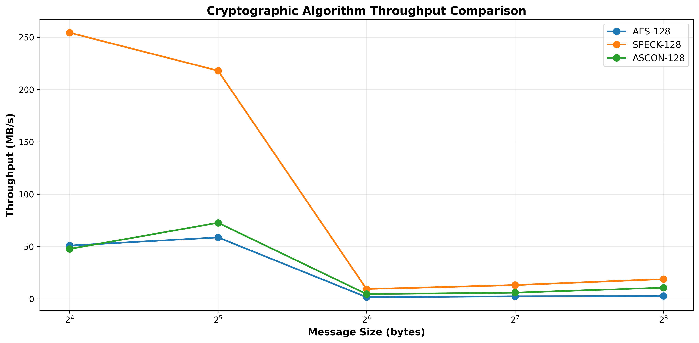
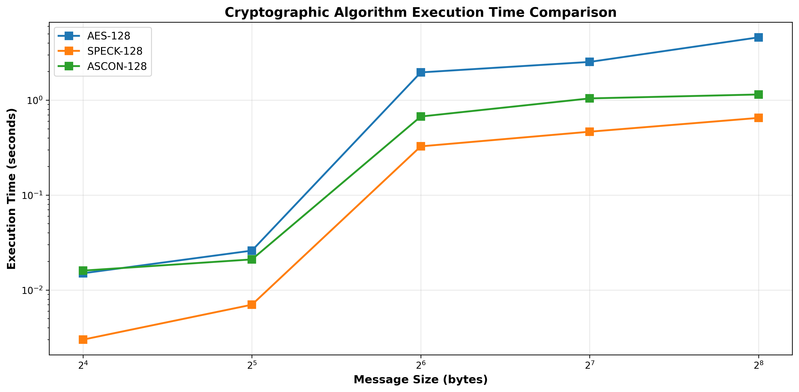
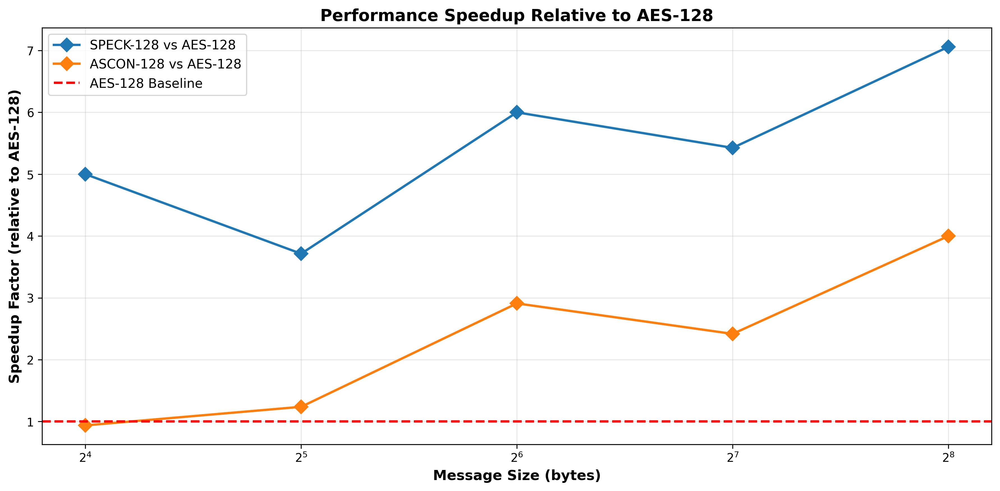
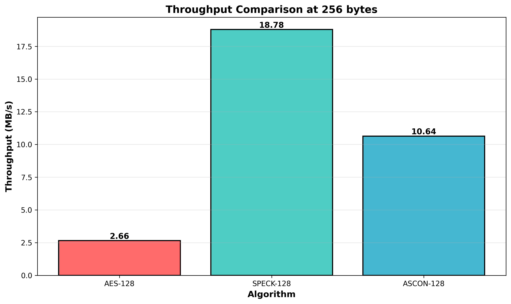

## Lightweight cryptographic algorithms comparison
 
A benchmarking project that compares the performance of three lightweight
cryptographic algorithms implemented in C, tested across multiple message sizes as a part of CSE_3121 PRINCIPLES OF CRYPTOGRAPHY class.
 
---
 
## Algorithms Compared
 
| Algorithm | Type | Key Size | Block Size | Notes |
|-----------|------|----------|------------|-------|
| AES-128 | Block Cipher (ECB) | 128-bit | 128-bit | Industry standard |
| SPECK-128 | Block Cipher | 128-bit | 128-bit | NSA-designed, software-optimized |
| ASCON-128 | AEAD | 128-bit | 64-bit rate | NIST LWC competition winner |
 
---
 
## Benchmark Results
 
All tests: **50,000 iterations**, compiled with GCC `-O3` on Windows x86-64.
 
### Throughput (MB/s)
 
| Message Size | AES-128 | SPECK-128 | ASCON-128 | Fastest |
|:---:|:---:|:---:|:---:|:---:|
| 16 bytes  | 50.86 MB/s  | 254.31 MB/s | 47.68 MB/s  | SPECK (5.0× faster than AES) |
| 32 bytes  | 58.69 MB/s  | 217.98 MB/s | 72.66 MB/s  | SPECK (3.7× faster than AES) |
| 64 bytes  | 1.56 MB/s   | 9.36 MB/s   | 4.54 MB/s   | SPECK (6.0× faster than AES) |
| 128 bytes | 2.42 MB/s   | 13.13 MB/s  | 5.85 MB/s   | SPECK (5.4× faster than AES) |
| 256 bytes | 2.66 MB/s   | 18.78 MB/s  | 10.64 MB/s  | SPECK (7.1× faster than AES) |
 
### Key Findings
- **SPECK-128** is the fastest across all message sizes, up to **7× faster than AES-128**
- **ASCON-128** outperforms AES-128 on larger messages (32 bytes and above)
- **AES-128** shows inconsistent performance, likely due to lack of hardware AES-NI in this build
- SPECK's advantage comes from its simple ARX (Add-Rotate-XOR) structure
---
 
## Project Structure
 
```
├── aes.c / aes.h           # AES-128 ECB implementation
├── speck.c / speck.h       # SPECK-128/128 implementation
├── ascon128_ref.c          # ASCON-128 reference implementation
├── aead.h                  # AEAD interface header
├── main.c                  # Benchmark runner (interactive)
├── plot_results.py         # Python script to visualize results
├── compile.bat             # Windows build script
├── results.txt             # Sample benchmark output
└── *.png                   # Generated performance charts
```
 
---
 
## How to Build & Run
 
### Requirements
- GCC (via [MSYS2/MinGW](https://www.msys2.org/) on Windows)
- Python 3 + matplotlib + numpy (for plots)
### Build
```bash
compile.bat
```
Or manually:
```bash
gcc -O3 aes.c speck.c ascon128_ref.c main.c -o benchmark.exe
```
 
### Run Benchmark
```bash
./benchmark.exe
```
You will be prompted to enter:
- Number of iterations (default: 50,000)
- Message size in bytes (multiples of 16 recommended)
Results are saved automatically to `results.txt`.
 
### Generate Plots
```bash
pip install matplotlib numpy
python plot_results.py
```
This generates 4 charts:
- `throughput_comparison.png`
- `execution_time_comparison.png`
- `throughput_bar_chart.png`
- `speedup_comparison.png`
---
 
## Performance Charts
 
### Throughput Comparison

 
### Execution Time Comparison

 
### Speedup Relative to AES-128

 
### Throughput at 256 bytes

 
---
 
## Why These Algorithms?
 
| | AES-128 | SPECK-128 | ASCON-128 |
|---|---|---|---|
| **Designed for** | General purpose | Lightweight software | IoT / constrained devices |
| **Security** | Well-studied | Debated (NSA origin) | NIST validated |
| **Speed (software)** | Moderate | Very fast | Fast |
| **Authentication** | No (ECB mode here) | No | Yes (AEAD) |
| **Best use case** | Servers with AES-NI | Microcontrollers | IoT with auth needs |
 
---
 
## Notes & Limitations
 
- AES is tested in **ECB mode without hardware acceleration (AES-NI)** — in real-world use
  with AES-NI enabled, AES performance would be significantly higher
- SPECK is tested as a **raw block cipher** (no authentication)
- ASCON includes **authentication overhead** (AEAD), making the comparison not perfectly apples-to-apples
- All tests use a **zero key** for simplicity
---
 
## References
 
- [NIST Lightweight Cryptography](https://csrc.nist.gov/projects/lightweight-cryptography)
- [ASCON Specification](https://ascon.iaik.tugraz.at/)
- [SPECK Paper (NSA)](https://eprint.iacr.org/2013/404.pdf)
- [AES FIPS 197](https://nvlpubs.nist.gov/nistpubs/FIPS/NIST.FIPS.197.pdf)
